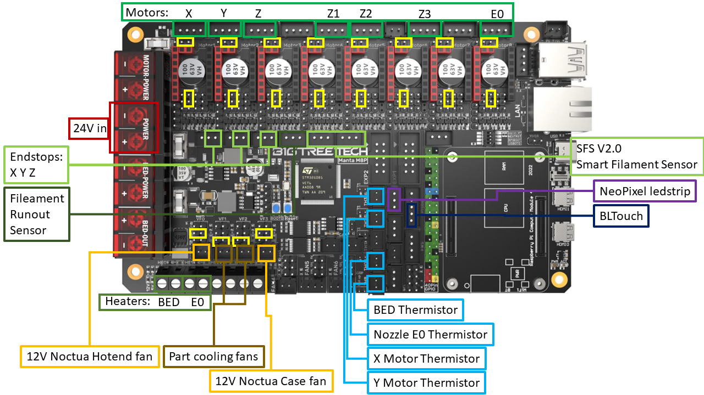
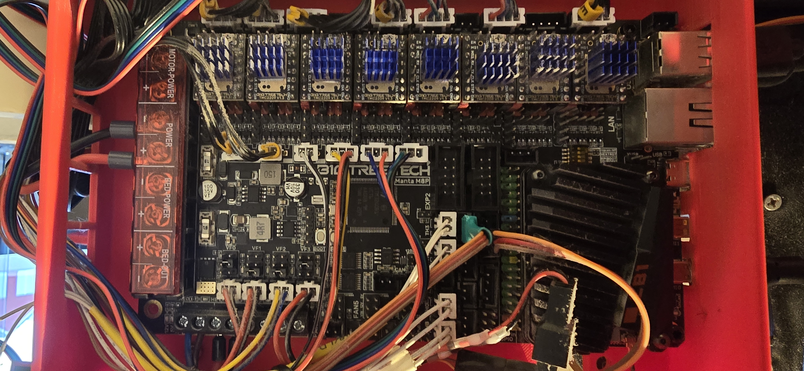
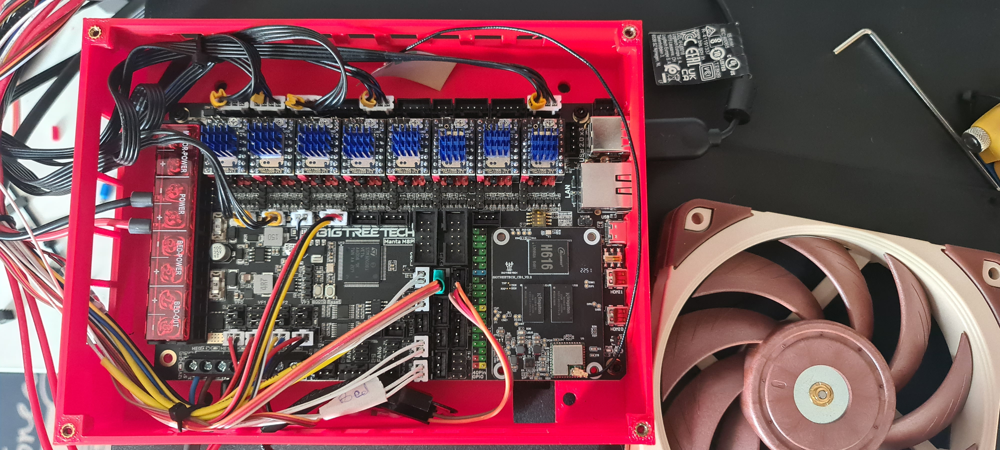
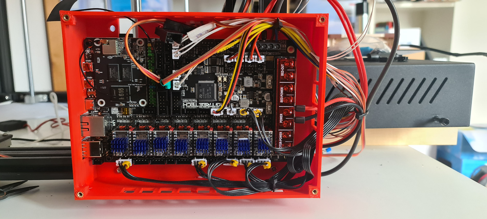
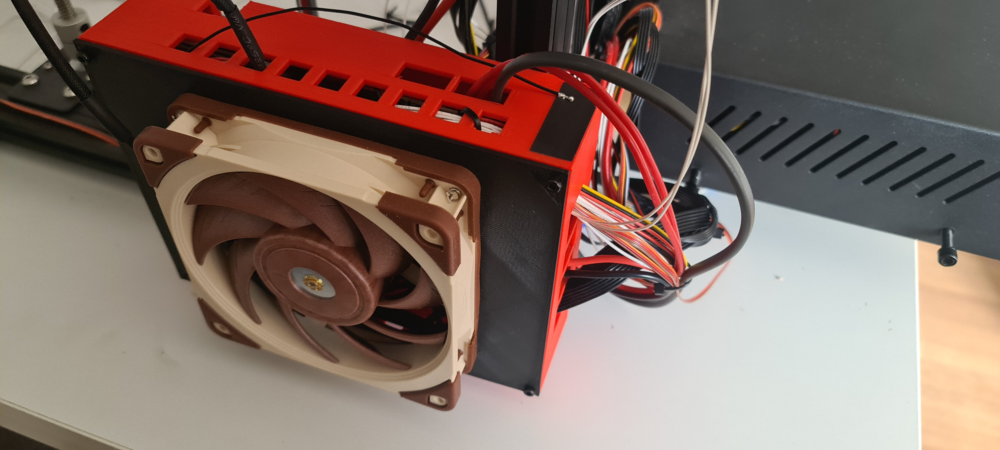

# E5P_Manta

The file connections.png is a picture of my pin out:
 * I had to take the sockets for the X, Y and Z endstop off because they are 3 pin sockets but the connectors are only 2 pins and they just don't fit :-( (With all the extra connectors that come with the Manta, I could have put the right ones on the wire but I chose not to, maybe I will in the near future, we'll see)
 * I added 2 additional thermistors to keep an eye on my X and Y motors
 * I also use a TriangleLab TD6 hotend 
 * I have a HeroMe GEN7 setup with 2 axial 24v part cooling fans (very important to set the fan volt selector jumpers to the correct voltage!)
 * The reason I put the Extruder motor on Motor8 is that I want to go Quad-Z so I left some room for 2 additional Z motors
 * I have the 2 current Z motors on separate drivers to allow for Z-Tilt adjustment
 * The yellow parts are jumpers I had to place
 * I left the MOFSET for the heated bed in place and just use the same wires on the Manta as were used on the previous boards (Stock board and BTT SKR mini 3 v3.0)

2024-02-02 Updates:
 * I am now running a tripple-Z configuration but I have the cables in place for a Quad-Z configuration (Left side, Z (Motor3) and Z1 (Motor5), Right side Z2 (Motor4); Z3 (Motor6) will be second Z motor on the right when I move to Quad-Z)
   * The reason for Z1 on Motor5 and Z2 on Motor4 is because in Dual-Z mode, I had Z on Motor3 and Z1 on Motor4, by moving to Triple-Z, Z1 became Z2 (stepper motor on the right side) and the new Z1 was added to Motor5
 * I added a BTT SFS V2.0 Smart Filament Sensor, which requires 2 sockets: PC1 and PC2
   * I left the original Filament Sensor attached to it's original socket just in case the new sensor doesn't do the job
   * For this sensor, I created a mount which, sadly, cannot be shared on Printables because it is created from 2 different models which have different licenses
 * These changes are reflected in the printer.cfg file

After the 2024-02-02 updates:

The other images are pictures of what it all looks like

The case came originally from [https://www.printables.com/model/454251-manta-m8p-backpack](https://www.printables.com/model/454251-manta-m8p-backpack) but I made a remix to allow for heat-set inserts to screw down the lid: [https://www.printables.com/model/481783-manta-m8p-backpack-case-update](https://www.printables.com/model/481783-manta-m8p-backpack-case-update)

Docs and other images can be found here: 
 * [https://github.com/bigtreetech/Manta-M8P](https://github.com/bigtreetech/Manta-M8P)
 * [https://github.com/bigtreetech/smart-filament-detection-module/tree/master/V2.0](https://github.com/bigtreetech/smart-filament-detection-module/tree/master/V2.0)

And I used this site to get Klipper on the Manta M8P: [https://3dpandme.com/2022/10/02/tutorial-btt-manta-m8p-cb1-klipper-guide/](https://3dpandme.com/2022/10/02/tutorial-btt-manta-m8p-cb1-klipper-guide/)https://3dpandme.com/2022/10/02/tutorial-btt-manta-m8p-cb1-klipper-guide/
