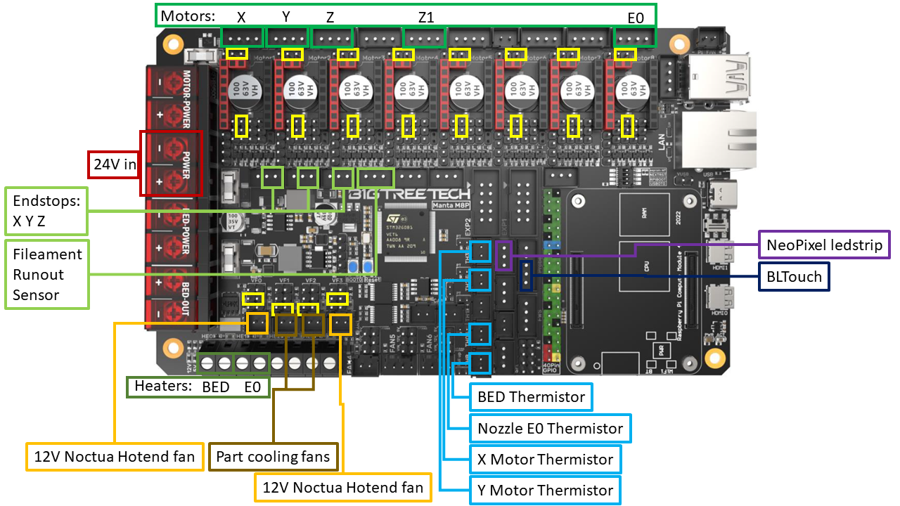

# E5P_Manta

The file connections.png is a picture of my pin out:
 * I had to take the sockets for the X, Y and Z endstop off because they are 3 pin sockets but the connectors are only 2 pins and they just don't fit :-(
 * I added 2 additional thermistors to keep an eye on my X and Y motors
 * I also use a TriangleLab TD6 hotend 
 * I have a HeroMe GEN7 setup with 2 axial 24v part cooling fans (very important to set the fan volt selector jumpers to the correct voltage!)
 * The reason I put the Extruder motor on Motor8 is that I want to go Quad-Z so I left some room for 2 additional Z motors
 * I have the 2 current Z motors on separate drivers to allow for Z-Tilt adjustment
 * The yellow parts are jumpers I had to place
 * I left the MOFSET for the heated bed in place and just use the same wires on the Manta as were used on the previous boards (Stock board and BTT SKR mini 3 v3.0)

The other images are pictures of what it all looks like

The case came from https://www.printables.com/model/454251-manta-m8p-backpack

Docs and other images can be found here: https://github.com/bigtreetech/Manta-M8P

And I used this site to get Klipper on the Manta M8P: https://3dpandme.com/2022/10/02/tutorial-btt-manta-m8p-cb1-klipper-guide/
